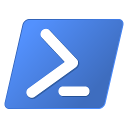

# PowerShell Scripting

> a collection of awesome PowerShell Resources

Repository for the Facebook Group [PowerShell Scripting](https://www.facebook.com/groups/169862746384097/?fref=nf). To contribute to this repository, please see [Contribution Guidelines](CONTRIBUTING.md), or simply create a new [issue](https://github.com/nickbeau/PowerShellScripting/issues/new/choose) if you want it done for you. This repository contains useful PowerShell scripts and articles that have been curated by the group.

## Contents

- [PowerShell Scripting](#powershell-scripting)
  - [Contents](#contents)
  - [Introduction](#introduction)
    - [What is PowerShell](#what-is-powershell)
    - [What is the Facebook Group](#what-is-the-facebook-group)
    - [What is this repository](#what-is-this-repository)
  - [Scripts](#scripts)
  - [Humorous Scripts](#humorous-scripts)
  - [Other Repositories](#other-repositories)
  - [Articles](#articles)
  - [Disclaimer](#disclaimer)

## Introduction

### What is PowerShell

Windows PowerShell is a shell initially developed by Microsoft for task automation and configuration management. PowerShell is now an [open-source project](https://github.com/PowerShell/PowerShell), and it can be installed on Windows, macOS, and Linux platforms. This shell is based on the .NET framework, and it includes a command-line shell and a scripting language.

### What is the Facebook Group

The Facebook group, [PowerShell Scripting](https://www.facebook.com/groups/169862746384097/?fref=nf) is a group with 24,200 members dedicated to working together on scripts, questions, and answers.

### What is this repository

This repository is a maintained list of scripts, articles and more, curated by the community which allows members to quickly find answers to questions and more.

## Scripts

- [Copy all files and folders](scripts/copyAllfilesandfolders.ps1) - Copies all files and folders recursively, from a request by Arun Kumar.
- [Function Template](scripts/functiontemplate.ps1) - Creates a new function. This template contains and describes many of the different options you can use to create a function.
- [Get Office 365 SKUs and write to Event Log](scripts/writeMsolSkuToEventlog.ps1) - This script connects to Office 365 and writes the current AccountSKUs to the Application Event Log as Informational Messages.
- [PowerShell Profile Backup](https://github.com/01000001-01001110/PowershellProfileBackup) - This amazing tool backups up a profile, with a UI, all from PowerShell.

## Humorous Scripts

- [Get Answer from Google](scripts/googlefunction.ps1) - Add this script to your profile and you'll always be close to getting the google answer you need. - From [StackOverflow](https://stackoverflow.com/questions/32703483/get-google-search-results-via-powershell).
- [Kill Covid-19](scripts/kill-covid19.ps1) - It would be nice to have this script but for now, it doesn't seem to work, even on Linux.

## Other Repositories

- [PowerShell Scripts Repository for Active Directory](https://support.atera.com/hc/en-us/articles/221113188-PowerShell-Scripts-Repository-for-Active-Directory?mobile_site=true&fbclid=IwAR2IhxgJgaUbh9xiWwnbSXqJXKmJ3eR0lo374XitW4x1IZsXGWyYeyKGlSI) - Atera and more specifically Liron Hanania's script library for Active Directory and Windows Administration.

## Articles

- **[Conditional Logic with If-Else](https://adamtheautomator.com/powershell-if-else/?fbclid=IwAR0-8E1XlJPzKZ8pq_74-Mauz2QhJoWXRk_DN2oMovgb0SLUAueMFInSkEE)** - a key part of any scripting is conditional logic, allowing your script to make decisions. This script from [June Castillote](https://junecastillote.github.io/) gives a great example of this.
- **[Export Office 365 License Expiry Date Report](https://o365reports.com/2020/03/04/export-office-365-license-expiry-date-report-powershell/)** - This superb report helps admins know when users' licenses are due to expire.
- **[Just Enough Administration](https://docs.microsoft.com/en-us/powershell/scripting/learn/remoting/jea/overview?view=powershell-7)** - Just Enough Administration (JEA) is a security technology that enables delegated administration for anything managed by PowerShell. Using JEA you can reduce the number of administrators, restrict what users can do and ensure Just Enough rights to do the job, rather than knee-jerk and deliver full admin rights to everyone.
- **[How to Generate an Office 365 Active User Report](https://www.lazyexchangeadmin.com/generate-office365-active-user-report/?fbclid=IwAR0xAY1GwGM5NXHBo8EhJaax1m5EVf8weIijZoqyMFcOSSVnp62DOXeJvAw)** - this walkthrough on LazyExchangeAdmin shows how to create an **Active Users Report** using PowerShell and the Microsoft Graph Rest API.
- **[Managing NTFS Permissions with PowerShell](https://4sysops.com/archives/managing-ntfs-permissions-with-powershell/?fbclid=IwAR2IPkYFIU-315lvDLY74GvNn4Xo7gNWP7Yi7tfBBsXCvw_cKToKicwlv_Y)** - this great article by Timothy Warner explains how to use PowerShell to manage NTFS Permissions.
- **[Writing Powershell GUIs the easy way](https://popeen.com/2019/02/09/writing-powershell-uis-the-easy-way/)** - Talking about different ways of structuring powershell UIs and introducing a module for super quick creation of easy and readable UIs.
- **[Building Powershell GUIs that won’t freeze when you use them](https://popeen.com/2019/02/15/bulding-powershell-guis-that-wont-freeze-when-you-use-them/)** - A quick look at writing multi-threaded UIs with PowerShell using the EasyGUI module

## Disclaimer

This list is for information purposes only. There is no warranty express or implied regarding the scripts and links above and their applicability or fitness for purpose. You are responsible and take all risks for any of the scripts you use.
